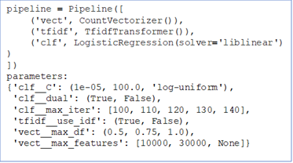

# **Development of a model for automatic labeling news articles - A natural language processing case study**

[TOC]

## Executive summary

The present project presents an end-to-end machine learning model for automatic labelling of news articles. The project aimed to demonstrate multiple stages of real life machine learning problems. The main components of the project include:

1.  Data collection: A database of over 350,000 news articles that were scrapped from various English-language sources was adopted for the project. The database was closely examined to ensure the quality of the data was acceptable for the purpose of this project.

2. Text pre-processing: A comprehensive pipeline was developed for text cleaning processes such as noise cleaning, spell checking, contraction mapping, lemmatization.

3. EDA and feature engineering: A wide range of exploratory data analysis and feature engineering techniques were utilized to explore any meaningful trend in the dataset.

4. Text vectorization: Transforming text data to integers is mandatory for an NLP application. Multiple techniques such as TFIDF and Doc2Vec were examined in this project.

5. Machine learning model: This project adopted several machine learning algorithms such as NaiveBayes, logistic regression, and support vector machines for multi-class text classification. The BayesSearchCV was used to investigate the impact of a wide range of hyper-parameters for text vectorization and classification algorithms on the performance of the models.

6. Deep learning: Several deep learning architectures using convolutional neural network (CNN), long-short term memory network (LSTM), and transformers with BERT was examined for text classifications. The results were compared against the best-performing machine learning model. A CNN-based model was selected for the deployment.

7. Model deployment: The code was refactored and used for the development of a modular codebase. PyTest was used for the development of the methods. FastAPI was used to create an app for the model, and Docker was used to containerize the app. GitHub actions were adopted to automatically deploy the image to the DockerHub registry and the automated deployment of the container to AWS elastic container services (ECS).

The codebase and the detailed discussion of each stage are available through this repository.

## 1. Introduction

Historically people used to receive news from local sources such as local newspaper and tv channels. Advances in communication technologies enables gathering more news from various sources and from all over the globe. Some journalists go to the battle lines to report events, and huge news agencies hire reports in every country for quick first-hand access to the news. For the last two decades, access to the internet has become more available in more places. Globally, Internet users increased from only 413 million in 2000 to over 3.4 billion in 2016. People started to use their smartphones and laptops to accomplish many tasks. The data on the internet is growing at an unprecedented speed.

In the last two years, many people have started joining online groups and using video conferencing for the first time because of the COVID19 effect on our day-to-day life. The digital transformation accelerated in all aspects of communication, such as using new digital tools. While the COVID19 crisis threat has been receding with the introduction of vaccines, it proved that the audience's need for fast access to reliable news is critical for our collective responsibility for longer-term threats such as climate change. Moving forward, publishers increasingly recognize that long-term survival is likely to involve stronger and more profound connections with audiences online. A recent study on the future of digital news indicated that most people are not paying for online information, and publishers rely on the advertisement. For those who subscribe, the most crucial factor is the distinctiveness and quality of the content.

## 2. Motivation

Text is one of the fastest growing data types on the internet. Generally, a subject matter expert label the text data. However, the tags used and the criteria for labeling may differ among authors and subject matter experts. This project aims to develop a natural language processing (NLP) model to automatically assign labels to news articles. The proposed model enables journalists to further promote their articles and audience to quickly access the content.

## 3. Approach

This project will review a large corpus of news articles published in 2020 that were focused on non-medical aspects of the pandemic. The goal is to develop a machine-learning tool to pre-process a manuscript, extract the main features in the document, and suggest appropriate tags for the article. The tags facilitate a more accurate understanding of the main themes in a document and help writers and publishers ensure readers can easily find the content.  

This project is a supervised learning classification problem, and I used multiple algorithms to compare their performance for the given task. The final product is accessible via an API deployed on AWS ECS. The website interface will provide a window for the authors to write their manuscript and receive feedback on tags and the title. The overall approach for the model development is shown in Figure 1. The project stages include text pre-processing and EDA, three main streams for modeling: (i) classical machine learning, (ii) distributed representation of the text using the Doc2Vec model, and (iii) deep learning, develop production-ready code, and finally the deployment process.

| Figure 1. The schematic of the techniques used for the model development |
| :----------------------------------------------------------: |
|  |

## 4. Data sources

The main source of data for this project is the [Covid-19 Public Media Dataset by Anacode](https://www.kaggle.com/jannalipenkova/covid19-public-media-dataset) on Kaggle.

> The database is a resource of over 350,000 online articles with full texts which were scraped from online media in the time span January 1 - December 31, 2020. The dataset includes articles from more than 60 English-language resources from various domains and is meant to provide a representative cross-section of the online content that was produced and absorbed during this period. The heart of this dataset are online articles in text form - thus, it is meant to be analyzed using Natural Language Processing and text mining. The data was scraped from a range of more than 60 high-impact blogs and news websites. We have been scraping the 65 websites continuously every day, after which we filtered them on Covid19-related keywords to keep only relevant articles in the dataset. 

The attributes include author, date, domain, title, url, content, and topic area. There are eleven topic areas - general, business, finance, tech, science, consumer, healthcare, automotive, environment, construction, and ai. The details of the initial EDA and data wrangling is available in the [EDA  - Covid public media dataset](notebooks/1.0-ra-covid-publicmedia-dataSet-eda.ipynb) from the notebooks directory of this project.

## 5. Text pre-processing

Text produced through web scraping is typically highly noisy containing spelling errors, abbreviations, non-standard words, false starts, repetitions, missing punctuations, missing letter case information, pause filling words, and other texting and speech disfluencies. The following process used in this project of text cleaning. The detail description of the text pre-processing steps is available in the [Text Preprocessing](notebooks/2.0-ra-text-preprocessing.ipynb) from the notebooks directory of this project.

- Noise Cleaning: remove HTML tags, accented text, and special characters
- Spell Checking: correct misspelled words, and remove meaningless strings
- Contraction Mapping
- Lemmatization
- ‘Stop Words’ Identification
- Case Conversion

These steps are only required for classical machine learning models. Fewer steps was used to pre-process the text for the deep learning models. 

## 6. EDA and Feature Engineering

The following section provide a brief description of EDA steps in this project. The details of the EDA is available in the [Text Parsing, EDA, and Feature Engineering](notebooks/3.0-ra-EDA-and-Feature-Engineering.ipynb) from the notebooks directory of this project. 

### 6.1. Length analysis

Estimating the length of the text is a relatively straightforward calculation yet can give a lot of insights. If the distributions are different with regard to the labels, then the new variable is predictive and can be used as a feature. In addition, I had to decide the upper limit for the length of articles as a hyper-parameter at the modeling stage. Some of the length measures I calculated for text data include:

- *word count*: counts the number of tokens in the text (separated by a space)
- *character count*: sum the number of characters of each token
- *sentence count*: count the number of sentences (separated by a period)
- *average word length*: sum of words length divided by the number of words (character count/word count)
- *average sentence length*: sum of sentences length divided by the number of sentences (word count/sentence count)

Figure 2 depicts the histogram of the character count by topic area. Most categories are positively skewed and no systematic differences cannot be found from the analysis.

| Figure 2. The distribution of the character count by topic area |
| :----------------------------------------------------------: |
|  |

### 6.2. Named entity recognition (NER)

Named-Entity Recognition (NER) is the process to tag named entities mentioned in unstructured text with pre-defined categories such as person names, organizations, locations, time expressions, quantities, etc. If NER can identify any systematic appearance of categories by labels, it can be helpful for additional information and improving the models. One of the best open source NER tools is SpaCy. It has a pretty rich dataset and identifies many categories, including:

| Category    | Description                                    | Category | Description                                          |
| ----------- | ---------------------------------------------- | -------- | ---------------------------------------------------- |
| PERSON      | People, including fictional                    | NORP     | Nationalities or religious or political groups       |
| FAC         | Buildings, airports, highways, bridges, etc.   | ORG      | Companies, agencies, institutions, etc.              |
| GPE         | Countries, cities, states.                     | LOC      | Non-GPE locations, mountain ranges, bodies of water. |
| PRODUCT     | Objects, vehicles, foods, etc. (Not services.) | EVENT    | Named hurricanes, battles, wars, sports events, etc. |
| WORK_OF_ART | Titles of books, songs, etc.                   | LAW      | Named documents made into laws.                      |
| LANGUAGE    | Any named language.                            | DATE     | Absolute or relative dates or periods.               |
| TIME        | Times smaller than a day.                      | PERCENT  | Percentage, including ”%“.                           |
| MONEY       | Monetary values, including unit.               | QUANTITY | Measurements, as of weight or distance.              |
| ORDINAL     | “first”, “second”, etc.                        | CARDINAL | Numerals that do not fall under another type         |

 The summary of top frequent tags are shown in Figure 3.

|  Figure 3. Top frequent tags from the NER analysis  |
| :-------------------------------------------------: |
|  |

### 6.3. Word cloud

A nice way to visualize the text information is with a word cloud where the frequency of each tag is shown with font size and color. I used the wordcloud module to visualize the underlying information in the corpus. Figure 4 depicts the results by topic area. For example, the word 'luxury' is common word for consumer category.

|          Figure 4. The word clouds by topic area          |
| :-------------------------------------------------------: |
|  |

## 7. Text vectorization

Machine learning algorithms require a numeric feature space. The input to these models is a two-dimensional table where rows are instances and columns are features. Therefore, transforming text documents into vector is a pre-requisite for any machine learning model on the text data. This process is known as text vectorization. This process transforms text data to a space where instances are entire documents or utterances, which can vary in length from quotes or tweets to entire books, but whose vectors are always of a uniform length. Each property of the vector representation is a feature. For text, features represent attributes and properties of documents—including its content and meta attributes, such as document length, author, source, and publication date. When considered together, the features of a document describe a multidimensional feature space on which machine learning methods can be applied. Several methods such as frequency based, one-hot encoding, TF-IDF, and distributed representation are available for text vectorization. In this project, I used the TF-IDF and distributed representation methods to transform the news corpus.

### 7.1. TF-IDF

TF–IDF, *term frequency–inverse document frequency*, encoding normalizes the frequency of tokens in a document with respect to the rest of the corpus. Therefore, it consider the relative frequency or rareness of tokens in the document against their frequency in other documents. The central insight is that meaning is most likely encoded in the more rare terms from a document. Mathematically, we can define TF-IDF as tfidf = tf x idf, which can be expanded further to be represented as follows.
$$
tfidf(w,d) = tf(w,d) * log(c/df(w)) 
$$
Generally both the term frequency and inverse document frequency are scaled logarithmically to prevent bias of longer documents or terms that appear much more frequently relative to other terms. 

### 7.2. Distributed representation

Since frequency models encode similarities between documents in the context of that same vector space, they may fail to compare documents that don’t share items even if they are semantically similar. On the other hand, distributed representation tries to encode text along a continuous scale with a distributed representation. Therefore, the document is represented in a feature space that has been embedded to represent word similarity.

Word2Vec and Doc2Vec are two distributed representation models created by a team of researchers at Google. The intent of the Word2Vec is to project words into a latent space. It uses two main techniques for this purpose:

- Continuous Bag of Words (CBOW): The distributed representations of context (or surrounding words) are combined to predict the word in the middle.
- Skip-gram: The distributed representation of the input word is used to predict the context

| Figure 5. Schematics of the Word2Vec transformation techniques |
| :----------------------------------------------------------: |
|      |

The goal of the Doc2Vec is to project a paragraph or a document into a latent space. Doc2Vec uses similar approaches for data transformation:

- Distributed Memory: Randomly sample consecutive words from a paragraph and predict a center word from the randomly sampled set of words by taking as input — the context words and a paragraph id
- Distributed Bag of Words (DBOW): Ignores the context words in the input, but force the model to predict words randomly sampled from the paragraph in the output.

| Figure 6. Schematics of the Doc2Vec transformation techniques |
| :----------------------------------------------------------: |
|       |

I used the Doc2Vec in this project. The main steps of using the Doc2Vec model include:

- Splitting the data in train and test groups: 
  - Used the Scikit-Learn train-test split model with a ratio of 30% test data.
- Tokenizing and tagging the articles: 
  - Gensim has a tokenizer to which create word tokens. 
  - Article index as the tag for each entry. Tags are unique IDs for each article used to look-up the learned vectors after training.
- Initializing the model:
  - Training a Doc2Vec model is a memory intensive process. I had to adopt measures to fit the data in memory. A tool for managing the size of the model is the *vector_size* which indicates the dimensionality of the feature vectors. I set it to 100 for the base case. 
  - The default number of iterations (epochs) over the corpus is 10 for Doc2Vec. Typical iteration counts in the published Paragraph Vector paper results, using 10s-of-thousands to millions of docs, are 10-20. More iterations take more time and eventually reach a point of diminishing returns. I used 15 epochs for the base case 
  - Tested different values with Bayes search.
- Building the vocabulary dictionary: 
  - The vocabulary is a list of all of the unique words extracted from the training corpus.
- Training the Doc2Vec NN: 
  - Use the *model.train* to fit the create embedding for each article.
- Infer vectors: 
  - Use the trained model to infer a vector for any piece of text by passing a list of words to the *model.infer_vector* method. This vector can then be compared with other vectors via cosine similarity.

The detailed description of the model is available in the [Doc2Vec Model](notebooks/4.2-ra-Modeling-Doc2Vec.ipynb) from the notebooks directory of this project.

## 8. Machine learning models

For this project I use the following steps to evaluate various methods of classifications:

1. Experiment with a prototype:
   - Select a subset of dataset for protoyping
   - Implement various classification algorithms
     - *NaiveBayes*
     - *Logistic Regression*
     - *Support Vector Machine*
   - Select appropriate classification methods for the dataset
2. Extend the analysis to the entire dataset
   - Merge topic areas with low samples to reduce the impact of unbalance in the dataset
   - Apply BayesSearchCV to select the suitable hyper-parameters
   - Select the best performing classification model as the basis of comparison for the deep learning model
3.  Develop a classification model using the distributed representation  

### 8.1. Experiment with a prototype

In the first step of the modeling I used the transformed word vectors from the feature engineering stage. I used the TFIDF with maximum 1000 features to vectorize the pre-processed text. Each article has a topic-area that was defined in the original dataset. Since the number of articles per topic area are not balanced, I filtered out the tags with low frequency for the prototype. The comprehensive description of the modeling strategy, results, and the discussions are available in the [Classification](notebooks/4.1-ra-Modeling-ClassificationAlgorithms.ipynb) from the notebooks directory of this project.

#### 8.1.1. NaiveBayes

I used the Scikit-Learn's multinomial Naive Bayes classifier which is suitable for classification with discrete features (e.g., word counts for text classification). According to the documentation the multinomial distribution normally requires integer feature counts. However, in practice, fractional counts such as tfidf may also work.

To examine the performance of the classification model I used the ROC and precision-recall curves. ROC curves typically feature true positive rate on the Y axis, and false positive rate on the X axis. This means that the top left corner of the plot is the “ideal” point - a false positive rate of zero, and a true positive rate of one. This is not very realistic, but it does mean that a larger area under the curve (AUC) is usually better. In addition, precision is the ability of the classifier not to label as positive a sample that is negative, and recall is the ability of the classifier to find all the positive samples. 

Figure 7 show the results of this analysis. The results indicate that the model struggles to classify the under-represented classes.

| Figure 7. Performance metrics for the NaiveBayes model (a) receiver operating characteristics curves (b) precision recall curve |
| :----------------------------------------------------------: |
|         |
|                             (a)                              |
|          |
|                             (b)                              |

#### 8.1.2. Logistic regression

Logistic regression, despite its name, is a linear model for classification rather than regression. Logistic regression is also known in the literature as logit regression, maximum-entropy classification (MaxEnt) or the log-linear classifier. In this model, the probabilities describing the possible outcomes of a single trial are modeled using a logistic function. 

The detailed results are available in the notebook and is not shown here for the sake of brevity. Figure 8 depict the precision recall curve for the logit model. The logistic regression had a higher performance compared with the NaiveBayes model for the classification of articles in the existing dataset. The recall score for the "finance" class has improved, which means the model could correctly classify one third of finance articles. The f1-score for the two other classes has improved as well.

| Figure 8. Precision recall curve for the logistic regression model |
| :----------------------------------------------------------: |
|                              |

#### 8.1.3. Support vector machine (SVM)

SVC and NuSVC implement the “one-versus-one” approach for multi-class classification. In total, n_classes * (n_classes - 1) / 2 classifiers are constructed and each one trains data from two classes. To provide a consistent interface with other classifiers, the decision_function_shape option allows to monotonically transform the results of the “one-versus-one” classifiers to a “one-vs-rest” decision function of shape (n_samples, n_classes).

I used the One-vs-One (ovo) shape fuctions which fits one binary classification model for each pair of classes. The SVM classifier had a high performance for the classification of the articles. While the results are encouraging the model too a long time for the training phase. Since, I was working with a subset of the articles and feature space, it would be very challenging to extend this method to the whole dataset. I saved the model for reference, but will not use that in the next step. The confusion matrix for the this model is presented below.

|               | precision | recall | f1-score | support |
| ------------- | --------- | ------ | -------- | ------- |
| business      | 0.90      | 0.97   | 0.94     | 73389   |
| finance       | 0.91      | 0.50   | 0.64     | 6628    |
| general       | 0.92      | 0.81   | 0.86     | 25502   |
|               |           |        |          |         |
| accuracy      |           |        | 0.90     | 105519  |
| macro  avg    | 0.91      | 0.76   | 0.81     | 105519  |
| weighted  avg | 0.91      | 0.90   | 0.90     | 105519  |

### 8.2. Hyper-parameter optimization

Two generic approaches to parameter search are provided in scikit-learn: for given values, GridSearchCV exhaustively considers all parameter combinations, while BaysianSearchCV can sample a given number of candidates from a parameter space with a specified distribution.

#### 8.2.1. BayesSearchCV

In this project I used the BayesSearchCV for hyper-parameter optimization. BayesSearchCV implements a “fit” and a “score” method. It also implements “predict”, “predict_proba”, “decision_function”, “transform” and “inverse_transform” if they are implemented in the estimator used. The parameters of the estimator used to apply these methods are optimized by cross-validated search over parameter settings. In contrast to GridSearchCV, not all parameter values are tried out, but rather a fixed number of parameter settings is sampled from the specified distributions. The number of parameter settings that are tried is given by n_iter. Parameters are presented as a list of skopt.space.Dimension objects.

#### 8.2.2. Merge topic area

Since the prototype analysis indicated that the models had difficulty with under-represented classes, the topic areas with low samples were merged to create fewer classes with higher number of samples. The final set include five topic areas: business, finance, general, science, and tech. The goal was to reduce the number of under represented classes; however, my goal was to avoid creating classes that included articles with significant semantic differences.

#### 8.2.3. NaiveBayes

I examined a wide range of values for vectorization and NaiveBayes model. The parameter space and the results are shown in Figure 9. It is evident that the model struggles to classify the classes with lower number of data points. It is proven that the low performance of Naive Bayes in this project is associated with the imbalance in the dataset.

| Figure 9. The Naive Bayes hyper-parameter tuning (a) the parameters (b) precision recall curve |
| :----------------------------------------------------------: |
|  |
|                             (a)                              |
|                   |
|                             (b)                              |

#### 8.2.4. Logistic regression

I examined a wide range of values for vectorization and logistic regression model. I used the liblinear solver for the logistic regression to avoid an error associated with the scikit-learn library trying to decode an already decoded string. The parameter space and the results are shown in Figure 10. 

| Figure 10. The logistic regression hyper-parameter tuning (a) the parameters (b) precision recall curve |
| :----------------------------------------------------------: |
|  |
|                             (a)                              |
|                   |
|                             (b)                              |

Hyperparameter tuning had a noticeable impact on the performance of the logistic regression model. The recall for the finance class is almost doubled. The f1-score also shows improvement compared with the prototype model. The precision and recall score for the added classes are comparable with the scores of the finance class. All these classes have fewer samples compared with the "business" class. I believe the current results are the among the best scores that can be achieved with classical machine learning algorithms for the existing dataset. In the next phase I will use these results as a basis for comparison with the deep learning models in the next stage.

### 8.3. Classification model using the distributed representation

Neither NLTK nor Scikit-Learn provide implementations of distributed representation of word embeddings. Gensim’s implementation allows users to train both Word2Vec and Doc2Vec models on custom corpora and also conveniently comes with a model that is pretrained on the Google news corpus.

#### 8.3.1. Train the Doc2Vec model

To train the model, first I loaded the corpus into memory and created a list of *Tagged Document* objects, which extend the *Labeled Sentence*, and in turn the distributed representation of word2vec. *Tagged Document* objects consist of words and tags. I instantiated the tagged document with the list of tokens along with the article index, that uniquely identifies the instance.

Once the list of tagged documents was generated, the code instantiated the Doc2Vec model and specify the size of the vector as well as the minimum count, which ignores all tokens that have a frequency less than that number. Once instantiated, an unsupervised neural network is trained to learn the vector representations, which can then be accessed via the *docvecs* property.

The model itself can be saved to disk and retrained in an active fashion, making it extremely flexible for a variety of use cases. However, on larger corpora, training can be slow and memory intensive, and it might not be as good as a TFIDF model with Principal Component Analysis (PCA) or Singular Value Decomposition (SVD) applied to reduce the feature space.

#### 8.3.2. Classification with logistic regression

In the previous section, I concluded that the logistic regression is the most appropriate model for classification of articles in this dataset. So, I used logistic regression to classify the articles using the embedding generated with the Doc2Vec model. Doc2Vec is not native to the Scikit-Learn and in order to use the BayesSearchCV for hyper-parameter optimization I created a wrapper around the Gensim's Doc2Vec model that uses a similar structure as native Scikit-Learn classes. The wrapper is a class where:

- The Doc2Vec parameters is passed to the `__init__`
- Defined the tagging, tokenization, building vocabulary, and training in the fit method 
- The transform method returns the infer_vector for train and test data.

The Doc2Vec hyper-parameters I used in this project include:

- window – The maximum distance between the current and predicted word within a sentence.
- dm - Defines the training algorithm. If dm=1, ‘distributed memory’ (PV-DM) is used. Otherwise, distributed bag of words (PV-DBOW) is employed.
- vector_size – Dimensionality of the feature vectors.
- min_count – Ignores all words with total frequency lower than this.
- epochs – Number of iterations (epochs) over the corpus. Defaults to 10 for Doc2Vec.

| Figure 11. The parameters used for the hyper-parameter tuning of the logistic regression and the Doc2Vec embedding |
| :----------------------------------------------------------: |
|  |

The confusion matrix of the best model of the BayesSearchCV of the logistic regression and the Doc2Vec embeddings are shown below. Running a BayesSearchCV is very time intensive step. The results of BayesSearch did not improve the classification results. So, I did not explore a more focused hyper-parameter space and will move to another model to investigate performance of deep learning for the given dataset.

|               | precision | recall | f1-score | support |
| ------------- | --------- | ------ | -------- | ------- |
| business      | 0.70      | 0.96   | 0.81     | 73674   |
| finance       | 0.00      | 0.00   | 0.00     | 6763    |
| general       | 0.62      | 0.22   | 0.33     | 25951   |
| science       | 0.00      | 0.00   | 0.00     | 1614    |
| tech          | 0.00      | 0.00   | 0.00     | 2674    |
|               |           |        |          |         |
| accuracy      |           |        | 0.69     | 110676  |
| macro  avg    | 0.26      | 0.24   | 0.23     | 110676  |
| weighted  avg | 0.61      | 0.69   | 0.62     | 110676  |

Further details about the methodology and results can be found on the [Doc2Vec Model](notebooks/4.2-ra-Modeling-Doc2Vec.ipynb) from the notebooks directory of this project.

## 9. Deep learning models

Recurrent neural networks can obtain context information and the convolutional neural networks (CNN) excel at learning the spatial structure in input data. The text analysis method based on CNN can obtain important features of text through pooling but it is difficult to obtain contextual information. In this project I applied the CNN and bi-directional long-short term memory (bi-LSTM) models to the news dataset and compared their performance for text classification. For each model I used various architectures using a systematic approach: (i) Starting with simple layers, (ii) Increase the number of nodes to improve the accuracy, and (iii) Add drop-out layers when the model start to overfit to the training data.

### 9.1. Data processing

I used the approach used earlier to merge the under-represented classes. The data set has five main topic area: business, finance, general, tech, and science. The deep learning model do not require comprehensive data text pre-processing used in the previous stage. For this stage, the code removed HTML tags, and meaningless words.  

Stratified sampling aims at splitting a data set so that each split is similar with respect to class densities. In a classification setting, it is often chosen to ensure that the train and test sets have approximately the same percentage of samples of each target class as the complete set. Scikit-Learn's train_test_split module splits the data in a stratified fashion, using this as the class labels. I used stratified data split approach to create three subset of data:

- %30 for test
- %70 for training
  - %20 for validation
  - %80 for training

|  Figure 12. Data split strategy for the deep learning model  |
| :----------------------------------------------------------: |
|  |

I used Keras Tokenizer to create embeddings. The `Tokenizer` class vectorize a text corpus into a list of integers. By default, all punctuation is removed, turning the texts into space-separated sequences of words (words maybe include the `'` character). These sequences are then split into lists of tokens. They will then be indexed or vectorized. `0` is a reserved index that won't be assigned to any word. As shown in Figure 13, each integer maps to a value in a dictionary that encodes the entire corpus, with the keys in the dictionary being the vocabulary terms themselves. 

The `pad_sequences` class adds padding to the end of each article to ensure all entries are the same length (i.e., `maxlen` in this case). Sequences that are shorter than `maxlen` are padded with `0` until they are `maxlen` long. Sequences longer than `maxlen` are truncated so that they fit the desired length.

| Figure 13. Sample of the vocabulary mapping by Keras Tokenizer |
| :----------------------------------------------------------: |
|      |

### 9.2. Convolutional neural network (CNN)

Convolutional neural networks (CNNs) are the most widely used deep learning architectures in image processing and image recognition. The CNN models include several major architectural components which are paired with each other in multi-story structure that is: Convolution, Pooling, and dense layers.

A convolution layer is responsible for the heavy lifting in a CNN architecture. For NLP applications the CNN involves sliding weight matrix (known as filter) on the embeddings. Similar to image processing each filter can detect different features of the data, the deeper the filter, the more likely it will capture more complex details. All this is done without hardcoding any of the filters. Backpropagation will ensure that the weights of these filters are learned from the data.

Pooling is responsible for the dimensionality reduction in CNNs. The central idea is that we have to divide the output layers into subsections and calculate a value that best represents the output. The reason why this is so effective is that it helps the algorithm learn higher-order representations of the data while reducing the number of parameters. Types of pooling:

- Sum pooling
- Max pooling
- Average pooling

Flattening involves converting the pooled feature map into a single column that will be passed to the dense layer. The dense layer at the end receives the input from the previous pooling and convolutional layers, it then performs a classification task. The Dropout layer randomly sets input units to 0 with a frequency of rate at each step during training time, which helps prevent overfitting. The last layer uses a softmax to decide the label for each instance.

Various architectures was examined in this project. The architecture that I picked as one of the best performers is shown in Figure 14. The details of the model is available in the [Deep Learning Model - CNN and LSTM](notebooks/4.4-ra-Modeling-DL-CNN.ipynb) from the notebooks directory of this project.

| Figure 14. The architecture of the CNN model |
| :------------------------------------------: |
|               |

The prevent the model from overfitting to the training data, I added dropout layers and early stopping. Early stopping is a form of regularization used to avoid overfitting when training a learner with an iterative method. At each epoch, the early stopping monitors the performance of the model on the validation set. The validation set is not used to train the model. A simple trigger for the early stopping is to stop the training process as soon as the performance of the model on the validation set is decreased compared to its value at the prior epoch. However, the training of a neural network is stochastic and can be noisy and the validation error can still go further down after it has begun to increase. To avoid such scenarios I used a `patience` parameter which trigger the early stopping after a decrease in performance observed over a provided number of epochs. 

|          Figure 15. The CNN model training history           |
| :----------------------------------------------------------: |
|  |

The results of CNN model training is provided in Figure 15 and the confusion matrix is shown below. The results indicate that the CNN model outperform the previous models including logistic regression and Doc2Vec. It is the candidate for the deployment. So, I saved the tokenizer, model architecture, and weights for the deployment.

|               | precision | recall | f1-score | support |
| ------------- | --------- | ------ | -------- | ------- |
| business      | 0.92      | 0.97   | 0.94     | 73935   |
| finance       | 0.89      | 0.74   | 0.81     | 6788    |
| general       | 0.91      | 0.87   | 0.89     | 25646   |
| science       | 0.47      | 0.09   | 0.15     | 1690    |
| tech          | 0.52      | 0.52   | 0.52     | 2617    |
|               |           |        |          |         |
| accuracy      |           |        | 0.91     | 110676  |
| macro  avg    | 0.74      | 0.64   | 0.66     | 110676  |
| weighted  avg | 0.90      | 0.91   | 0.90     | 110676  |

### 9.3. CNN + LSTM

In advanced artificial neural network, a recurrent neural network (RNN) is a type of this category. RNNs can use their internal state (memory) to process sequences of inputs. RNNs have shown great successes in many natural language processing tasks. They connect previous information to present task. A modification of the Recurrent neural networks is Long short term memory (LSTM). LSTM able to retain the knowledge about previous outputs when
compared with the regular feed forward neural network. The retention part is due to the feedback loop present in their architecture.

The CNN model focused on extracting spatial information as features, whereas the LSTM model focused on extracting temporal information (from the past to the future). CNN-LSTM model, therefore, can combine and use both types of information together. The basic idea is to use the CNN model first to extract the spatial information. Then, instead of flatten them, we feed them directly to the LSTM model for classification.

In this project I used a CNN + Bi-LSTM approach for text classification. The Bidirectional LSTM is making the neural network to have the sequence information in both directions backwards (end to beginning) and forward(beginning to end).  The model sends the embeddings to a single convolution layer, followed by an average pooling and a bi-directional LSTM. The output is then passed to a single dropout layer and a dense layer. A softmax layer was used to predict the labels. I used early stopping to avoid overfitting. The history of training is shown in Figure 16. The results showed that the model tend to overfit very quickly and the model performance is lower than the CNN model.

|         Figure 16. History of CNN + LSTM training         |
| :-------------------------------------------------------: |
|  |

### 9.4. BERT

BERT and other Transformer encoder architectures have been wildly successful on a variety of tasks in NLP (natural language processing). They compute vector-space representations of natural language that are suitable for use in deep learning models. The BERT family of models uses the Transformer encoder architecture to process each token of input text in the full context of all tokens before and after, hence the name: Bidirectional Encoder Representations from Transformers.

BERT models are usually pre-trained on a large corpus of text, then fine-tuned for specific tasks. In this project I used a version of small BERT. Small BERTs have the same general architecture but fewer and/or smaller Transformer blocks, which lets you explore tradeoffs between speed, size and quality.

Text inputs need to be transformed to numeric token ids and arranged in several Tensors before being input to BERT. TensorFlow Hub provides a matching preprocessing model for each of the BERT models, which implements this transformation using TF ops from the `TF.text` library. It is not necessary to run pure Python code outside the TensorFlow model to preprocess text.

I assembelled all pieces required in my BERT model including the preprocessing module, BERT encoder, data, and classifier. The model schematic is shown in Figure 17. The details of the model is available in the [Text Classification with BERT](notebooks/4.5-ra-Modeling-DL-BERT.ipynb) from the notebooks directory of this project.

| Figure 17. The schematics of the model developed with BERT |
| :--------------------------------------------------------: |
|   |

The model developed with BERT did not achieve a significant accuracy gain for the present dataset compared with the earlier models. Therefore, I will use the CNN model for the deployment.

## 10. Model deployment

Model deployment is an essential component of an end-to-end machine learning model. This step ensures the models can be shared with everyone, is robust, and can be maintained easily. The next sections describe the steps I took to ensure the model is production ready. 

### 10.1. Production ready code and testing

This stage mainly involved the code refactoring and writing a modular code. This step ensures the codebase is smaller and easier for reuse and maintenance. In addition, writing a modular code enables the development of tests to ensure future developments will not break the system. 

I refactored the code and developed the following main modules:

- Data processing pipeline: src -> data -> make_dataset.py
- Feature engineering pipeline: src -> features -> build_feature.py
- Modeling pipeline: 
  - Machine learning: src -> models -> classification_models.py
  - Deep learning: src -> models -> deep_learn_model.py
  - Training: src -> models -> train_model.py
  - Prediction: src -> models -> predict_model.py
- API: src -> api -> main.py
- Command line: src -> models -> command_line.py

For the above mentioned modules I developed tests using `PyTest`. PyTest is known for its ease of use, automatic detection of tests, and robust operation.

### 10.2. FastAPI

FastAPI is a high-performance framework for the development of API using Python 3.6+ based on standard Python type hints. It is known for high-performance, ease of use, and robust and standard based approach. I adopted FastAPI for the development of API in this project. The main steps of the present API are:

1. Load the required modules: `pickle`, `keras`, and `fastapi`
2. Load the tokenizer: A tokenizer was trained during the deep learning model training. To use the same embeddings used for the model training, the tokenizer was saved with `pickle`. The app will load and unpickle the saved tokenizer. This step is done when the API initiated and is available as long as the API is running. This approach ensures a fast response to the API requests.
3. Load the model: The next step is to load and assemble the saved model. The deep learning model structure was saved as a JSON file and the weights were saved as a h5 file. The app loads the structure and weights to assemble the model. Similar to the tokenizer, the model will be available as long as the API is running to ensure fast response to the API requests.
4. Create a FastAPI instance
5. Receive the request from the endpoint: The text should be send to the `/article/` endpoint as a `text` parameter.
6. Process the text and make predictions: The text will be passed to the tokenizer for vectorization. The vector is then passed to the model for predictions. 
7. Return response: The API returns the probability of each label for the requested text. A sample response is shown in Figure 18.

|       Figure 18. Sample API call of the present model        |
| :----------------------------------------------------------: |
|  |

### 10.3. Containerization

Docker is a set of platform as a service products that use OS-level virtualization to deliver software in packages called containers. It is the most popular and widely used containerization platform. Using Docker ensures the model can be easily deployed on other machines and cloud based solutions. In this project I created a Dockerfile to build Docker images for the app. The main components of the containerization workflow are:

- Base image: I used the official [tensorflow/tensorflow](https://hub.docker.com/r/tensorflow/tensorflow/)  image from the Docker Hub registry. This image is optimized for tensorflow applications.
- Copy the app to the image: The workflow copies the API code, pickled tokenizer, model architecture, and saved weights to the image. 
- Install requirements: The workflow installs the necessary packages based on the `requirements_prod.txt`. The requirements include the `fastapi` and `uvicorn`. The other packages needed for the operation of the app are pre-installed on the base image.
- Expose port: The workflow expose the port `80` of the container  to ensure it is accessible from the host.
- Run the API: The image uses `uvicorn` to run the app. Uvicorn is a web server implementation for Python. 

Once the image is built it can be used for running the app locally or on a cloud server.

### 10.4. CI/CD with GitHub actions

Continuous integration (CI) and continuous delivery (CD) is a process for frequent delivery of the apps by adopting automation in the stages of an app development. GitHub Actions provide a state-of-the-art CI/CD platform to build, test, and deploy the code on the GitHub. 

Figure 19 depicts the CI/CD workflow used in this project. Upon each code commits to the main branch, GitHub actions launches two workflows 

- Build the Docker image and push to the DockerHub registry: The latest version of the app is available from a public DockerHub repository. 
- Deploy the container to AWS elastic container services (ECS): This workflow is used for the deployment of the container. The details are described in the next section.

|      Figure 19. The CI/CD workflow with GitHub actions       |
| :----------------------------------------------------------: |
|  |

### 10.5. AWS elastic container services (ECS)

The last step in the deployment of this project is the workflow to push the container to an Amazon ECS service powered by AWS Fargate. AWS ECS is a highly scalable, high performance container management service that supports Docker containers and allows users to easily run applications on a managed clusters. AWS Fargate is a technology that provides on-demand, right-sized compute capacity for containers. The GitHub actions workflow for the deployment of the container in this project has two main components:

- Build and push the Docker image to AWS ECR: At each commits to the main branch the workflow builds a Docker image and push it to a private repository. The image is pulled from the AWS ECS for creating the container.
- Deploy container to AWS ECS: Download the task definitions from the AWS ECS, update the image id with the latest image, and deploy that to the ECS. The task definition is JSON file that describe the how the containers should be constructed and deployed.

The GitHub actions used in this project enabled a fast and automatic delivery of the app. The machine learning workflow will not end here; Continuous monitoring and maintenance is necessary to ensure the model accuracy and reliability. 

## Appendix 1. Project Organization

I used the cookiecutter template for this project. The project structure is briefly described below.

    ├── LICENSE
    ├── Makefile           <- Makefile with commands like `make data` or `make train`
    ├── README.md          <- The top-level README for developers using this project.
    ├── data
    │   ├── external       <- Data from third party sources.
    │   ├── interim        <- Intermediate data that has been transformed.
    │   ├── processed      <- The final, canonical data sets for modeling.
    │   └── raw            <- The original, immutable data dump.
    │
    ├── docs               <- A default Sphinx project; see sphinx-doc.org for details
    │
    ├── models             <- Trained and serialized models, model predictions, or model summaries
    │
    ├── notebooks          <- Jupyter notebooks. Naming convention is a number (for ordering),
    │                         the creator's initials, and a short `-` delimited description, e.g.
    │                         `1.0-jqp-initial-data-exploration`.
    │
    ├── references         <- Data dictionaries, manuals, and all other explanatory materials.
    │
    ├── reports            <- Generated analysis as HTML, PDF, LaTeX, etc.
    │   └── figures        <- Generated graphics and figures to be used in reporting
    │
    ├── requirements.txt   <- The requirements file for reproducing the analysis environment, e.g.
    │                         generated with `pip freeze > requirements.txt`
    │
    ├── setup.py           <- makes project pip installable (pip install -e .) so src can be imported
    ├── src                <- Source code for use in this project.
    │   ├── __init__.py    <- Makes src a Python module
    │   │
    │   ├── data           <- Scripts to download or generate data
    │   │   └── make_dataset.py
    │   │
    │   ├── features       <- Scripts to turn raw data into features for modeling
    │   │   └── build_features.py
    │   │
    │   ├── models         <- Scripts to train models and then use trained models to make
    │   │   │                 predictions
    │   │   ├── predict_model.py
    │   │   └── train_model.py
    │   │
    │   └── visualization  <- Scripts to create exploratory and results oriented visualizations
    │       └── visualize.py
    │
    └── tox.ini            <- tox file with settings for running tox; see tox.readthedocs.io

--------

<small>Project based on the <a target="_blank" href="https://drivendata.github.io/cookiecutter-data-science/">cookiecutter data science project template</a>. #cookiecutterdatascience</small>

